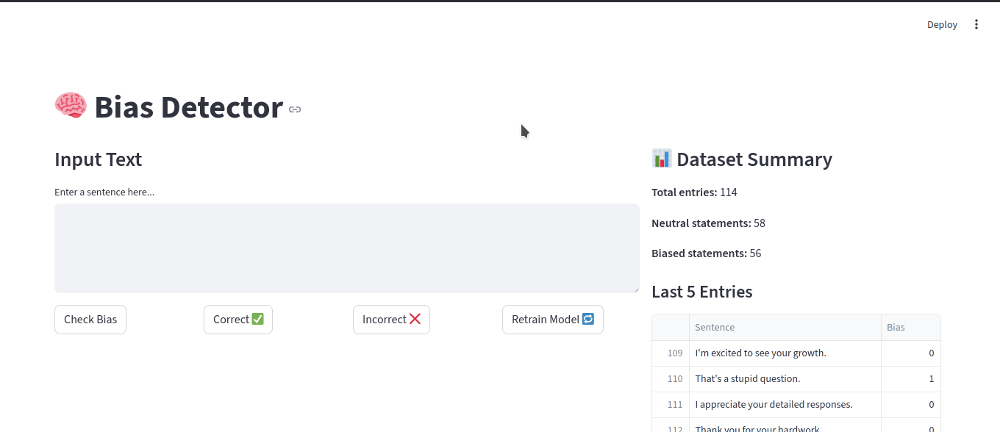

# 🧠 Bias Detector

[](https://streamlit.io/)
[](https://www.python.org/)
[](LICENSE)
[]()

---

### 👤 Developed by [**Jayesh**](https://www.instagram.com/jpg.py)  
**LinkedIn:** [linkedin.com/in/YOUR_LINKEDIN_ID](https://www.linkedin.com/in/YOUR_LINKEDIN_ID)  
🧩 *In collaboration with [CREATED Institute](https://www.instagram.com/created_institute)*  

---

## 🧩 Overview

**Bias Detector** is a simple yet powerful **Streamlit-based web app** that identifies whether a given sentence is **biased** or **neutral** using a **TF-IDF vectorizer** and **Logistic Regression**.  

It allows:
- ⚡ Real-time bias detection  
- 🔁 Instant model retraining with new examples  
- 💾 Local data storage in an Excel file  
- 📊 Dataset statistics and recent entries overview  

Everything runs **locally** — no external API or cloud dependency.

---

## 🧠 Key Features

✅ **Bias Classification** — Detects whether a text is “Neutral” or “Biased”  
🧮 **Machine Learning Core** — Built with `scikit-learn` and `TfidfVectorizer`  
🔁 **Retraining** — Model updates dynamically as you provide feedback  
💾 **Persistent Storage** — All labeled data saved in `database.xlsx`  
📊 **Live Summary** — View total, neutral, and biased entries in real-time  
🧱 **Simple UI** — Built entirely with Streamlit for fast iteration

---

## 🖼️ Screenshot


> Example to replace when ready:
> ```markdown
> 
> ```

---

## ⚙️ Installation & Setup

### 🧾 Prerequisites
Make sure you have **Python 3.8+** and **pip** installed.

---

### 🪜 1️⃣ Clone the Repository
```bash
git clone https://github.com/iotronixs/bias-detector.git
cd bias-detector
```

### 🪜 2️⃣ Create Virtual Environment
```bash
python -m venv venv
# Activate the environment
source venv/bin/activate   # On Linux/Mac
venv\Scripts\activate      # On Windows
```

### 🪜 3️⃣ Install Dependencies 
```bash
pip install -r requirements.txt
```

### 🪜 4️⃣ Run the App 
```bash
streamlit run app.py
```

---

## 🧭 How to Use

1. Enter a sentence in the text box.  
2. Click “Check Bias” to get a prediction.  
3. The result will display as either ✅ *Neutral* or ❌ *Biased*.  
4. If correct → click “Correct ✅” to save it.  
5. If wrong → click “Incorrect ❌” to correct and store the right label.  
6. Click “Retrain Model 🔁” to update the classifier.  
7. View dataset summary and last 5 entries in the right-hand column.

---

## 🗂️ Project Structure
```bash
bias-detector/
│
├── app.py                # Main Streamlit app
├── database.xlsx         # Automatically created local dataset
├── requirements.txt      # Dependencies
├── README.md             # This documentation
└── assets/               # Folder for screenshots & demo thumbnails
```

---

## 🧠 Behind the Scenes

The app workflow:
- Loads or creates `database.xlsx` for data storage.  
- Trains a Logistic Regression model using TF-IDF features.  
- Accepts user input and predicts bias probability.  
- Saves labeled sentences to Excel.  
- Allows on-demand model retraining.  

All computation is **offline**, making it lightweight and privacy-friendly.

---

## 🧩 Tech Stack

| Component | Technology |
|------------|-------------|
| Frontend/UI | Streamlit |
| Backend/ML | Scikit-learn |
| Data Storage | Excel (via openpyxl) |
| Language | Python 3.8+ |

---

## 🧠 Code Explanation

<details>
<summary><b>▶️ Expand to View Full Code Explanation</b></summary>

### 1️⃣ Import Dependencies
```python
import streamlit as st
import pandas as pd
from sklearn.feature_extraction.text import TfidfVectorizer
from sklearn.linear_model import LogisticRegression
import os
```

### 2️⃣ Load or Create Database
```python
def load_data():
    if os.path.exists(DATA_FILE):
        data = pd.read_excel(DATA_FILE)
    else:
        data = pd.DataFrame(columns=["Sentence", "Bias"])
        data.to_excel(DATA_FILE, index=False)
    return data
```

### 3️⃣ Train Model
```python
def train_model(data):
    if len(data) < 2:
        sentences = ["This is neutral.", "This is biased!"]
        labels = [0, 1]
    else:
        sentences = data["Sentence"].astype(str).tolist()
        labels = data["Bias"].astype(int).tolist()

    vectorizer = TfidfVectorizer()
    X = vectorizer.fit_transform(sentences)
    model = LogisticRegression()
    model.fit(X, labels)
    return model, vectorizer
```

### 4️⃣ Session State Initialization
Ensures all necessary data, models, and variables are stored persistently during app use.

### 5️⃣ Streamlit UI
Divided into two columns — input/controls and dataset summary.

### 6️⃣ Interaction Buttons
- **Check Bias:** Predicts the text bias.
- **Correct / Incorrect:** Adds feedback to the dataset.
- **Retrain Model:** Rebuilds model using all data.

### 7️⃣ Dataset Overview
Displays total entries, bias counts, and last 5 entries.

</details>

---

## 🖼️ Screenshot


>    ```markdown
>    
>    ```

---


## 🔮 Future Roadmap
- 🔍 Expand to multiple bias categories (political, gender, social)  
- 🧠 Integrate BERT or DistilBERT for deeper context analysis  
- ☁️ Add optional cloud backup for labeled data  
- 📤 Export dataset as CSV or JSON  
- 🎨 Improve visualization dashboard  

---

## ⚖️ License

This project is licensed under the **MIT License**.  
You’re free to use, modify, and share it — just credit the original author and institute.

---

## 🌐 Connect

| Platform | Link |
|-----------|------|
| 👤 **Author (Jayesh)** | [Instagram](https://www.instagram.com/jpg.py) / [LinkedIn](https://in.linkedin.com/in/jayesh-gautam-9ab98779) |
| 🧩 **Institute (CREATED)** | [Instagram](https://www.instagram.com/created_institute) |

---

## 💬 Support and Contribution

If you find this project useful:
- ⭐ Star the repository on GitHub  
- 🧩 Contribute by improving the UI, dataset, or model  
- 🧠 Share feedback on Instagram or LinkedIn  

---

🧩 *Created with logic, code, and caffeine.* ☕  
© 2025 **Jayesh x CREATED Institute**